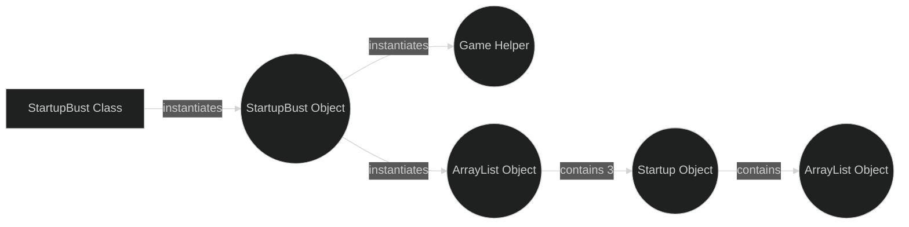

# Head First Java - Sink a Startup Game

```mermaid
---
config:
  theme: 'dark'
---
flowchart LR
    bustcls[StartupBust Class]
    bustobj((StartupBust Object))
    gamehobj((Game Helper))
    arrlstobj1((ArrayList Object))
    startupobj((Startup Object))
    arrlstobj2((ArrayList Object))
    bustcls -- instantiates --> bustobj
    bustobj -- instantiates --> gamehobj & arrlstobj1
    arrlstobj1 -- contains 3 -->  startupobj
    startupobj -- contains --> arrlstobj2
```